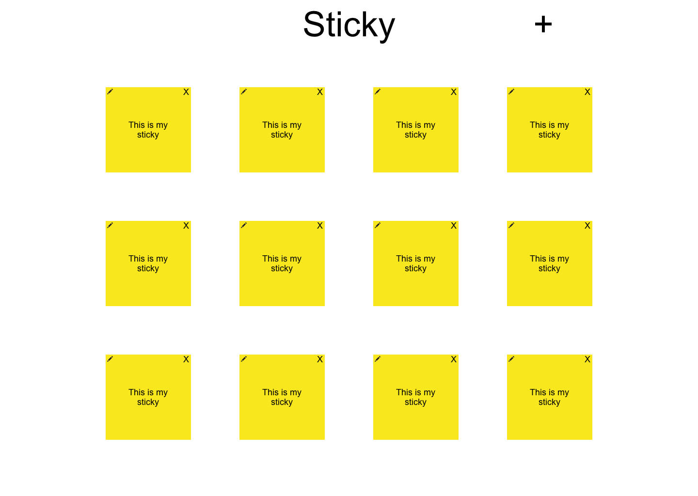

# Sticky

Routes:

GET /stickies - return all sticky notes

GET /stickies/:id - return specific sticky note id

POST /stickies - create new sticky note

PUT /stickies/:id - edit sticky note id

DELETE /stickies/:id - delete sticky note id

[Trello](https://trello.com/b/3QhSw1PE/sticky-project-2)

[Heroku](https://cfwdiproject2.herokuapp.com)
